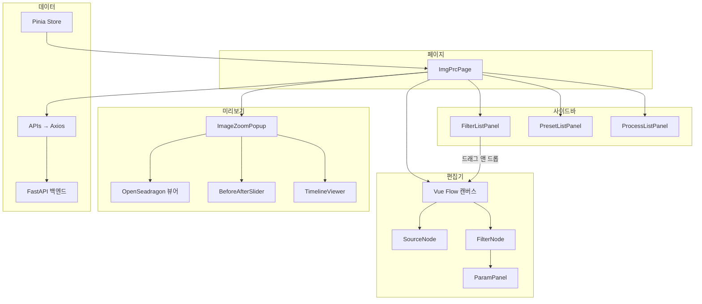
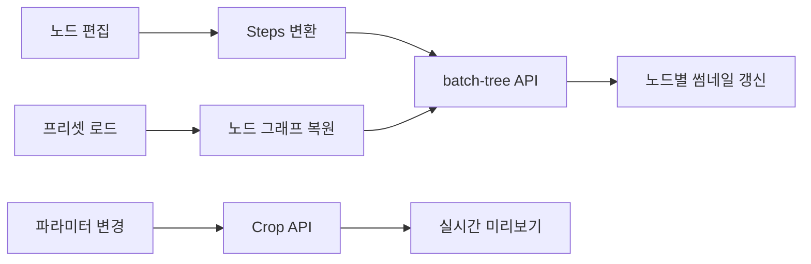

# Image Processing Studio

> 노드 기반 비파괴 이미지 편집 웹 애플리케이션

드래그 앤 드롭으로 필터 노드를 연결하고, 파라미터를 조절하면 실시간으로 결과를 확인할 수 있는 이미지 처리 도구입니다.

### 노드 기반 이미지 처리


### 프리셋 저장 & 불러오기


### 고해상도 확대 편집


## 왜 만들었나

기존 이미지 편집 도구는 필터를 순차 적용하면 중간 단계를 되돌리기 어렵고,
같은 입력에 다른 알고리즘을 비교하려면 작업을 반복해야 합니다.

이 문제를 해결하기 위해 **노드 그래프 기반 비파괴 편집**을 구현했습니다:

- 원본 이미지는 변경하지 않고, 필터 체인을 **트리 구조**로 관리
- 어떤 단계든 파라미터를 수정하면 하위 노드만 재계산
- **분기(sibling)** 로 같은 입력에 여러 필터를 나란히 비교

## 핵심 기능

### 노드 기반 편집기

Vue Flow로 구현한 시각적 편집기에서 필터 노드를 드래그 앤 드롭으로 배치하고,
엣지로 연결하여 처리 파이프라인을 구성합니다.
Dagre 알고리즘으로 노드를 자동 배치합니다.

### 실시간 미리보기

뷰포트 영역만 crop하여 필터를 즉시 적용합니다.
Before/After 슬라이더와 타임라인 뷰로 각 단계별 결과를 비교할 수 있습니다.

### 고해상도 이미지 탐색

OpenSeadragon 뷰어로 DZI 타일 기반 고해상도 이미지를 자유롭게 확대/축소합니다.
수천 px 이미지도 타일 단위로 로드하여 브라우저 메모리를 절약합니다.

### 프리셋 & 프로세스 관리

자주 사용하는 필터 조합을 프리셋으로 저장하고 재사용합니다.
편집 세션(프로세스)을 저장하여 이전 작업을 불러올 수 있습니다.

### 커스텀 필터

Monaco Editor로 Python 코드를 직접 작성하여 나만의 필터를 만들 수 있습니다.
파라미터 정의를 JSON으로 관리하고, 기존 필터와 동일하게 노드로 배치됩니다.

## 기술 스택

| 구분          | 기술                                                 |
| ------------- | ---------------------------------------------------- |
| 프레임워크    | Vue 3 + Quasar 2 (Composition API, `<script setup>`) |
| 언어          | TypeScript 5.9                                       |
| 노드 편집기   | Vue Flow + Dagre (자동 레이아웃)                     |
| 고해상도 뷰어 | OpenSeadragon 6                                      |
| 코드 편집기   | Monaco Editor                                        |
| 상태 관리     | Pinia                                                |
| HTTP          | Axios                                                |
| 스타일        | SCSS + Tailwind CSS 4                                |
| 빌드          | Vite (Quasar CLI)                                    |
| 테스트        | Vitest                                               |
| API 타입      | openapi-typescript (백엔드 스키마 자동 생성)         |

## 아키텍처

### 컴포넌트 구조



### 데이터 흐름



## 주요 설계 결정

| 결정        | 선택                         | 이유                                   |
| ----------- | ---------------------------- | -------------------------------------- |
| 편집 UI     | 노드 그래프 (Vue Flow)       | 트리 구조 워크플로우를 직관적으로 표현 |
| 미리보기    | Crop 기반 프록시             | 전체 이미지 처리 없이 즉시 결과 확인   |
| 고해상도    | DZI + OpenSeadragon          | 전체 로드 없이 타일 단위 렌더링        |
| API 타입    | openapi-typescript 자동 생성 | 백엔드 스키마 변경 시 타입 동기화 보장 |
| 커스텀 필터 | Monaco Editor 내장           | IDE 수준의 코드 편집 경험 제공         |

## 시작하기

### 사전 요구사항

- Node.js 20+
- pnpm 10+
- 백엔드 서버: [fastapi-server](https://github.com/사용자명/fastapi-server)

### 설치 및 실행

```bash
# 의존성 설치
pnpm install

# 개발 서버 실행
pnpm dev
```

### API 타입 재생성

백엔드 스키마가 변경된 경우:

```bash
# 백엔드 서버가 실행 중인 상태에서
pnpm gen:types
```

### 테스트

```bash
pnpm test:run
```

## 프로젝트 구조

```
src/
├── apis/                 API 함수 (filesApi, presetsApi, processesApi, customFiltersApi)
├── components/
│   ├── flow/             노드 편집기 (FilterNode, ParamPanel, ImageZoomPopup, TimelineViewer)
│   ├── sidebar/          사이드바 패널 (필터 목록, 프리셋, 프로세스)
│   └── dialog/           모달 (갤러리, 프리셋 저장, 커스텀 필터 편집기)
├── composables/          재사용 로직 (usePreviewManager, useCropManager)
├── constants/            필터 메타데이터, 파라미터 정의
├── pages/                페이지 (ImgPrcPage)
├── stores/               Pinia 스토어
├── types/                타입 정의 (api.d.ts 자동생성, 도메인 타입)
└── utils/                유틸리티 (Flow ↔ Step 변환, Dagre 레이아웃)
```

## 백엔드

이 프로젝트와 연동되는 백엔드 서버: [fastapi-server](https://github.com/banhyungil/fastapi-server)
